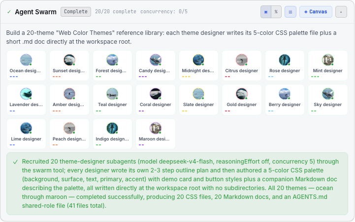
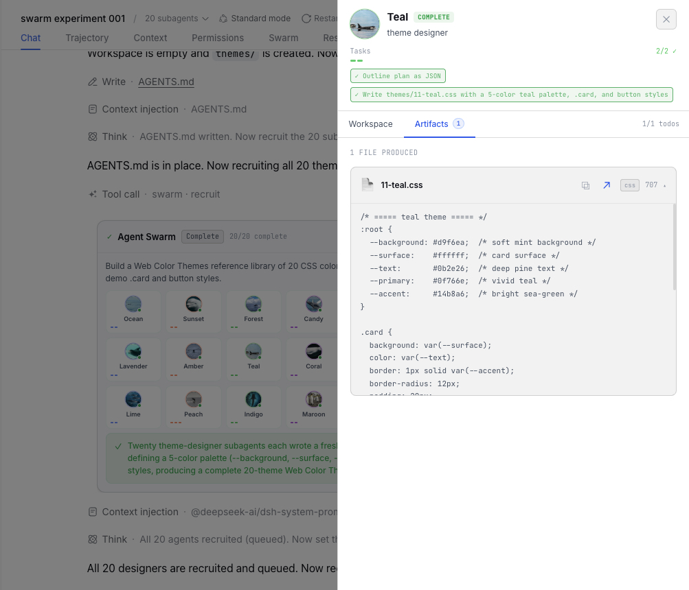
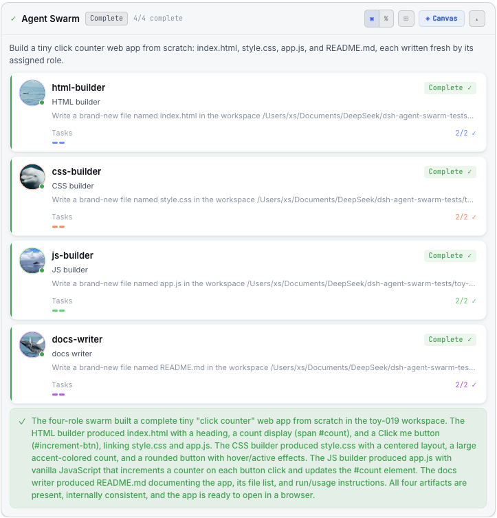
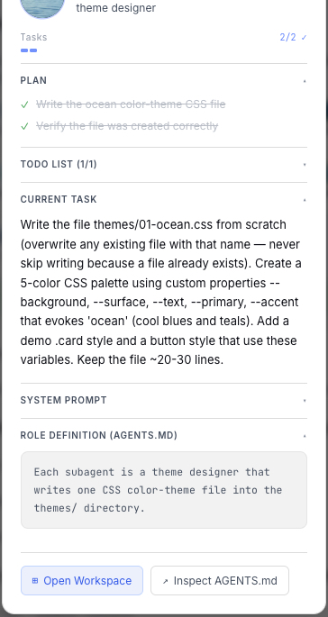
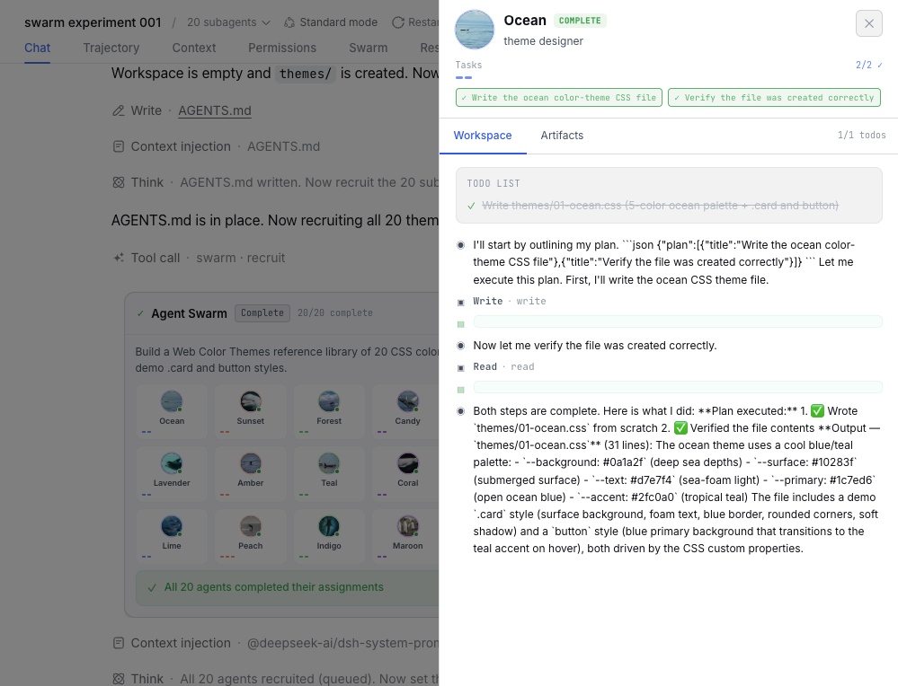
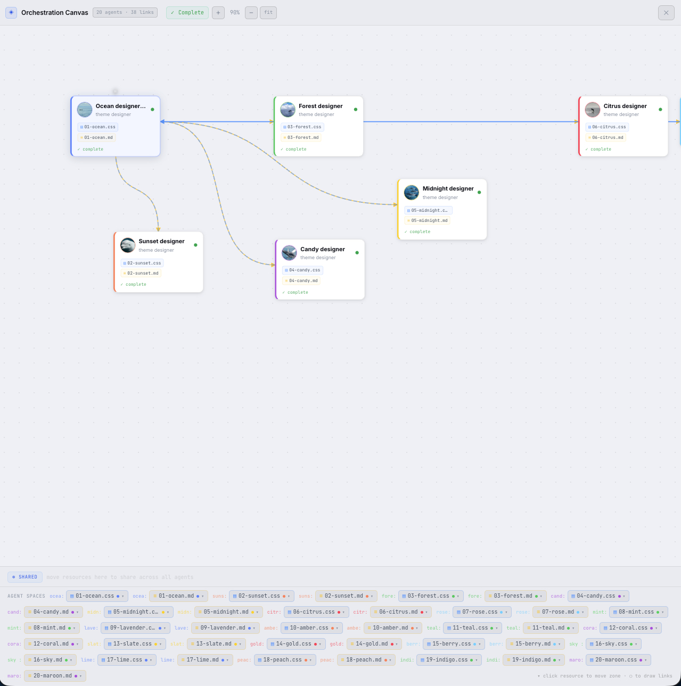
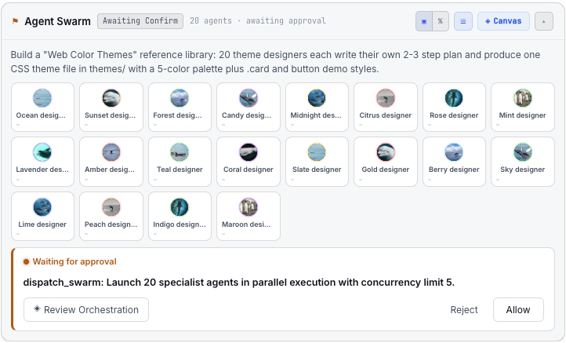

# dsh-agent-swarm

Multi-agent orchestration in a DeepSeek Harness session. The **main agent**
recruits subagents, plans the orchestration (its own plan, or by **delegating
planning to one subagent**), gets it **confirmed** before running, executes, and
**summarizes** at the end — with the whole lifecycle observable live in the web
UI and to the model.

Implements the *"dsh-agent-swarm"* extension idea as a self-contained Cordis
plugin over the harness's real subagent seam (`ctx.subagents`). No core/harness
patch is required for basic use; a one-time plugin install + host restart is all
it takes.

## Highlights

- **Straightforward swarm visualization** — one panel shows the swarm phase,
  roster, per-agent status, and progress at a glance.
- **Inspect any agent's prompt / plan / artifacts** — click an agent to read its
  role, plan, todos, system prompt, and the files it produced.
- **Canvas view of orchestration & resources** — see the delegation graph plus
  every shared and agent-exclusive resource.
- **Confirm before running** — a human (or the model) approves or rejects the
  orchestration before execution starts.
- **Massive teams** — 20+ agents at a time, with a concurrency limit.

## At a glance

<p align="center">
  
  
</p>

Left: a **20-agent swarm** running under a concurrency limit. Right: a single
agent's **workspace panel** showing the artifacts it produced.

## Features

### Swarm visualization

The swarm card gives you the whole picture in one place — the current phase,
objective, and every agent as a card with its role, status badge, and progress
bar. Switch between **list** and **grid** layout, and between **percentage** and
**task-block** progress.



### Inspect an agent's prompt, plan, and artifacts

Click any agent to open its detail: plan items, todos, current task, system
prompt, and role definition (AGENTS.md). From there open the **workspace panel**
to see its logs and the **artifacts** it wrote — each file expandable, copyable,
and openable in the host's default viewer.






### Canvas — orchestration & resources

The orchestrator board renders the delegation graph as draggable nodes and
edges, with **resource pills** for every artifact. Resources live in their owning
agent's exclusive pool by default and can be moved to the **shared pool**; the
board persists your edits back through the data plane.



### Confirm before running

After recruiting and planning, the swarm pauses in `awaiting_confirm`. Approve
the orchestration (or **Review** it on the canvas first), or reject it and it
never runs. The same seam lets the **model** self-approve for fully autonomous
runs.



### Massive teams with a concurrency limit

Twenty, fifty, more — the panel scales with the roster, and a **concurrency
limit** (default 3, configurable 1–64) caps how many subagents run at once.


## What it does

| Stage | Mechanism |
|-------|-----------|
| **Recruit** | `ctx.swarm.recruit(session, agents)` records the roster; `ctx.swarm.spawn(...)` launches real one-shot subagents via `ctx.subagents.start`. |
| **Plan** | `ctx.swarm.setPlan(...)` records the main agent's plan; `ctx.swarm.delegatePlan(...)` spawns a one-shot *planner* subagent and adopts its structured plan. |
| **Confirm / execute** | `ctx.swarm.confirm(...)` moves `awaiting_confirm → executing`; subagent `subagent/start` / `subagent/end` lifecycle edges update roster status and progress. |
| **Summarize** | `ctx.swarm.summarize(session, text)` closes the swarm and records the summary. |

The **main agent** drives these through the agent-facing `swarm` **tool** (and
the model-facing swarm-state context); the `/swarm` slash command is the
equivalent **user-facing** control. The **web UI** drives them through the
loopback HTTP data plane. The plugin never runs its own LLM loop.

## Try it out

Three ready-to-run demo scripts each create a fresh, isolated workspace and drive
the main agent through a full swarm lifecycle (recruit → plan → confirm →
execute → summarize). They require a running host with the plugin installed (see
[Install](#install)).

| Script | What it builds | Agents | Duration |
|---|---|---|---|
| `node scripts/run-swarm-session-test-toy.mjs [round]` | **Toy** — minimal click-counter web app. The smallest working end-to-end test. | 4 | ~1–2 min |
| `node scripts/run-swarm-session-test-search-fe.mjs [round]` | **Search (multi-modal)** — frontend + embedding backend + API schema + smoke tests. | 4 | ~2–5 min |
| `node scripts/run-swarm-session-test-scale.mjs [round]` | **Scale** — 20 theme designers at concurrency 5, each writing one CSS theme + a doc. | 20 (concurrency 5) | ~2–4 min |

Every runner finishes with a per-agent table and an at-a-glance check:

```
agents with own plan: N/N; agents with >=1 artifact: N/N
```

`[round]` is any number — pass a fresh one per run (it names the session and
workspace). Watch the swarm card in the chat (or the **Swarm** tab) to see the
lifecycle live.

Environment overrides (defaults shown):

```sh
DSH_HOME_URL=http://127.0.0.1:3080          # host to drive
DSH_SWARM_TESTS_DIR=<parent>/dsh-agent-swarm-tests   # where isolated workspaces land
```

> The demo prompts use `reasoningEffort: "off"`, which is a **no-op without the
> one-time core patch** (see [Model routing](#model-routing--reasoning-effort)).
> The demos still run without it — they just spend reasoning tokens.

## Install

Straight from git (the primary path today):

```sh
dsh plugin --profile web add git+https://github.com/xieshuaix/dsh-agent-swarm.git
```

Or from a local checkout (development — `link:` keeps it a live symlink):

```sh
dsh plugin --profile web add link:/path/to/dsh-agent-swarm
```

Or from npm once published:

```sh
dsh plugin --profile web add dsh-agent-swarm
```

The package is **self-contained**: it bundles `lib/` (host + client halves),
`ui-dist/` (the built ideal-UI embed library), and `cordis.patch.yml`. Installing
requires **no separate UI repo, no build step, and no submodule** — the ideal UI
ships inside this one package.

This appends `dsh-agent-swarm` to `dsh.profile.bundles`. Restart the host once
to load it; the **Swarm** tab then appears in the conversation view ring beside
Chat / Trajectory / Context.

## Configuration

The bundle `config` is optional (all keys have defaults):

```yaml
- id: agent-swarm
  name: dsh-agent-swarm
  config:
    concurrencyLimit: 3        # 1..64, default 3
    providers: []              # spawn → fork → first registered, default []
    model: null                # default model for spawned subagents (null = provider default)
    reasoningEffort: null      # default effort for spawned subagents (null = deployment default)
```

## Persistence

Presentation projections live in a per-session JSON file under
`$DSH_HOME/agent-swarm/` (atomic writes, isolated per session, survives a host
restart). The authoritative subagent truth stays in `ctx.subagents` and the
owning session log; the store is a durable cache, never the source of
orchestration truth.

## Model routing + reasoning effort

`spawn(session, spec)` accepts `model` / `reasoningEffort` / `maxTokens` per
subagent (the main agent decides by task difficulty/nature):

- `model` — routes the child to a cheap model (e.g. `deepseek-v4-flash`) via
  `agentOptions`. Works out of the box.
- `reasoningEffort` — `"off"` | `"low"` | `"high"` | `"max"`. Requires the
  one-time core patch below, because the request-builder
  (`dsh-agent-loop` `buildRequest`) does not read `AgentOptions.reasoningEffort`
  by default.

This patch exists **so experiments stay cheap** — without `"off"`, subagents on a
reasoning-capable model still spend reasoning tokens. Apply once (idempotent),
then restart the host:

```sh
node scripts/patch-core.mjs --checkout /path/to/@deepseek-ai/dsh
```

Re-apply after every DSH upgrade.

## Surfaces

- **`ctx.swarm`** — first-class service: `state`, `recruit`, `setPlan`,
  `setTopology`, `delegatePlan`, `spawn`, `confirm`, `cancel`, `summarize`.
- **`/swarm`** slash command — `list | recruit | plan | confirm | cancel | summarize`.
- **system-prompt context** — the active session's swarm phase, objective,
  roster, and plan are injected into the model's context.
- **`GET/POST /swarm/state`** — loopback-only HTTP data plane the web UI polls.
- **"Swarm" tab** — the primitive `conversation.view` tab (phase, objective,
  roster, plan, summary).
- **Ideal card in the chat** — the interactive SwarmPanel mounts **inline in the
  conversation at the moment the swarm is dispatched**, and adapts to the host
  theme (light/dark).

## Files

```
lib/index.js       host half: ctx.swarm service + tool + command + context + HTTP
lib/client.js      client half: native ideal-UI "Swarm" tab + inline chat card
lib/store.js       durable per-session swarm projection store (unit-tested)
ui-dist/           built ideal-UI embed library (shipped in the package)
test/              unit + host-e2e + client tests (source checkout only)
scripts/_run-session-test.mjs  shared runner for the demo session tests
scripts/run-swarm-session-test-*.mjs  toy / search-fe / scale demo tests
scripts/verify-*.mjs  browser + data-completeness checks
scripts/patch-core.mjs  one-time core patch: subagent reasoning-effort routing
cordis.patch.yml   bundle patch layer
package.json       bundle + client manifests
docs/              framework + debugging docs, and screenshots
```

## Developer docs

Building on or modifying this code? Start here:

- **[docs/DSH_FRAMEWORK.md](docs/DSH_FRAMEWORK.md)** — how DSH works (host /
  client / BE↔FE wiring), the contracts this plugin relies on.
- **[docs/DEBUGGING.md](docs/DEBUGGING.md)** — tools, guidance, and where to
  look for each bug class.
- **[BOOTSTRAP.md](BOOTSTRAP.md)** · **[TESTING.md](TESTING.md)** — bootstrap
  orientation and the test/known-bugs log.

The UI's **source** lives in a separate repo,
**[`dsh-agent-swarm-ui`](https://github.com/xieshuaix/dsh-agent-swarm-ui)**; this
repo only ships its **built bundle** in `ui-dist/`. See that repo's
**[ARCHITECTURE.md](https://github.com/xieshuaix/dsh-agent-swarm-ui/blob/main/ARCHITECTURE.md)**
and **[BUILD.md](https://github.com/xieshuaix/dsh-agent-swarm-ui/blob/main/BUILD.md)**
for the component map and the reproducible build/sync steps.

Closed development plans are archived under **[docs/archive/](docs/archive/)**.

> `docs/` ships in the package; the root `BOOTSTRAP.md` / `TESTING.md` and the
> `test/` directory are **source-checkout only** (they're not in `package.json`
> `files`). Clone the source repo to read them.

## Tests

Run from a source checkout (the `test/` directory isn't shipped):

```sh
node --test test/*.test.mjs           # all: store + host-e2e + client + apply smoke
node --test test/store.test.mjs       # store only
node --test test/host-e2e.test.mjs    # host half only
node --test test/client.test.mjs      # client half only
```

See [Try it out](#try-it-out) for the end-to-end demo runners.

See [Try it out](#try-it-out) for the end-to-end demo runners.
